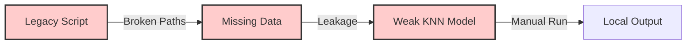
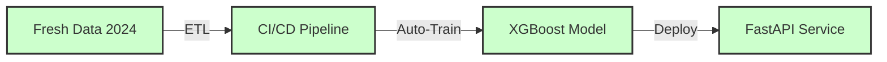
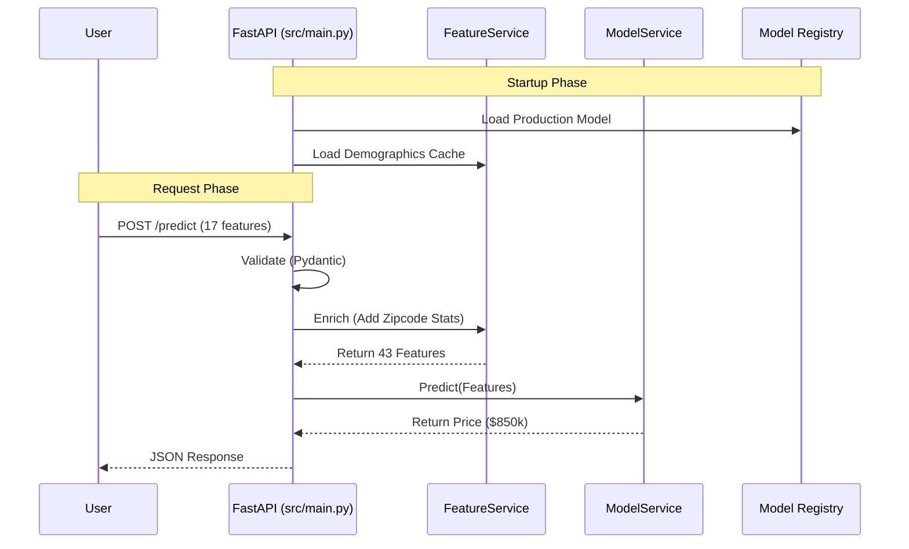
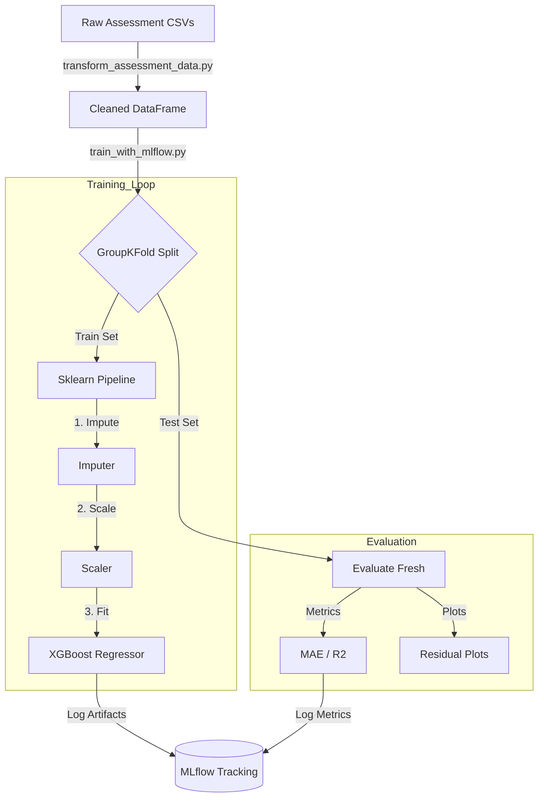

# Presentation Visuals: Real Estate Estimator

**Purpose:** These diagrams support the "Whiteboard Script" for the technical presentation. You can draw these on a whiteboard or present this document directly.

---

## 1. The "Before & After" (The Hook)

### Legacy State (The Problem)
A fragile, manual process with broken links and outdated data.



### Current State (The Solution)
A robust, automated enterprise pipeline.



---

## 2. High-Level Architecture (The "What")

This diagram shows how the system handles a user request in production.



**ASCII Version:**
```text
[ User ]
   |
   v
[ FastAPI Application ]
   |
   +--- 1. Validate Input (Pydantic)
   |
   +--- 2. Enrich Features (FeatureService) <--- [ Demographics Cache ]
   |       (Adds Income, Education, etc.)
   |
   +--- 3. Predict Price (ModelService) <------- [ XGBoost Model ]
   |
   v
[ JSON Response ]
```

---

## 3. The Training Pipeline (The "How")

This diagram shows how raw data becomes a deployable model.



---

## 4. Honest Evaluation (The "Why")

Visualizing why `GroupKFold` is necessary to prevent data leakage from repeat sales.

### The Wrong Way (Random Split)
*The model "memorizes" the house.*

```text
Parcel A (Sold 2021)  ----> [ TRAIN SET ]
Parcel A (Sold 2023)  ----> [ TEST SET  ]  <-- LEAKAGE!
                                              Model knows this house!
```

### The Right Way (GroupKFold)
*The model must generalize to unseen houses.*

```text
Parcel A (Sold 2021)  ----> [ TEST SET ]
Parcel A (Sold 2023)  ----> [ TEST SET ]

Parcel B (Sold 2022)  ----> [ TRAIN SET ]
Parcel C (Sold 2024)  ----> [ TRAIN SET ]

Result: Model has NEVER seen Parcel A. 
        It must predict based on features, not memory.

```
